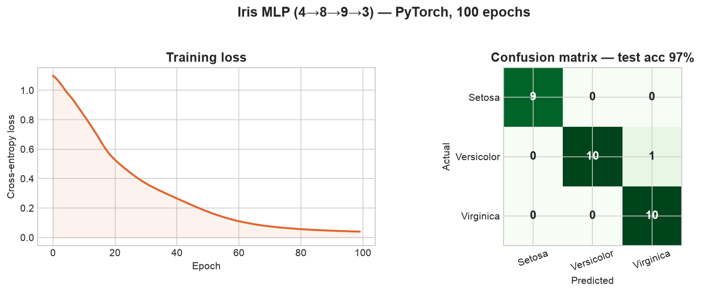

# Neural Network Experiments

Small, from-scratch **PyTorch** projects from my second year at Bennett — learning the
fundamentals by building them, not just reading about them. Two projects live here:

1. **Iris classifier** — a first feed-forward neural network
2. **Bone-fracture classifier** — a CNN on X-ray images

---

## 1. Iris classifier — a first neural network

A minimal multi-layer perceptron that classifies the classic **Iris** dataset (sepal/petal
measurements → one of three species).

- **Architecture:** `4 → 8 → 9 → 3`, ReLU hidden layers, `CrossEntropyLoss`
- **Training:** Adam (lr 0.01), 100 epochs, 80/20 train/test split
- **Result:** ~**97% test accuracy**



```bash
python src/simple_neuralnetwork.py     # needs: torch pandas scikit-learn matplotlib
```

The dataset is pulled from a public gist at runtime, so no local data is needed.

---

## 2. Bone-fracture classifier — CNN on X-rays

A convolutional network that classifies X-ray images as **`fracture`** vs **`normal`** — a step
up from the MLP into real image data and the problems that come with it (class imbalance, data
layout).

- **`model.py` — `BoneCNN`**: three `Conv → ReLU → MaxPool` blocks into two fully-connected
  layers; a dummy forward pass auto-computes the flatten size so the FC layer fits any input size.
- **`loss.py` — `FocalLoss`**: focal loss (α, γ) to down-weight easy examples and handle the
  fracture/normal class imbalance.
- **`dataset.py` — `BoneFractureDataset`**: a custom `torch.utils.data.Dataset` that loads images
  from `fracture/` and `normal/` folders.
- **`convert.py`**: reshapes a YOLO-style `images/` + `labels/` layout into `fracture/normal`
  class folders (a non-empty label file → fracture, empty → normal).
- **`train.py`**: the training loop, with class weighting for the imbalance.

> **Note:** the X-ray dataset isn't included in the repo. `train.py` and `convert.py` expect a
> local dataset — edit the path at the top of each before running.

---

## Setup

```bash
python -m venv venv && source venv/bin/activate
pip install torch torchvision pandas scikit-learn matplotlib pillow
```

## Structure

```
src/
  simple_neuralnetwork.py   # (1) Iris MLP — self-contained
  model.py                  # (2) BoneCNN architecture
  dataset.py                # (2) X-ray dataset loader
  loss.py                   # (2) FocalLoss
  convert.py                # (2) reshape dataset into class folders
  train.py                  # (2) training loop
assets/
  iris_results.png          # Iris training output (above)
```
